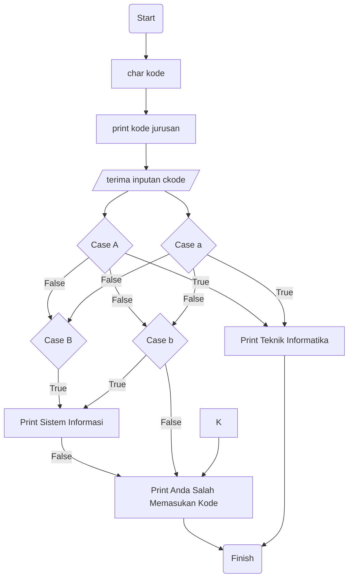

```mermaid

flowchart TD;
A(Start) -->B[char kode];
B --> C[print kode jurusan];
C --> D[/terima inputan ckode/];
D --> E{Case A};
D --> F{Case a};
E --True-->G[Print Teknik Informatika]
F --True-->G[Print Teknik Informatika]
E & F --False-->H{Case B}
E & F --False-->I{Case b}
H --True--> J[Print Sistem Informasi];
I --True--> J[Print Sistem Informasi];
J --False--> L((Default));
I --False--> L((Default));
K -->L[Print Anda Salah Memasukan Kode]
L & G --> N(Finish);

```
