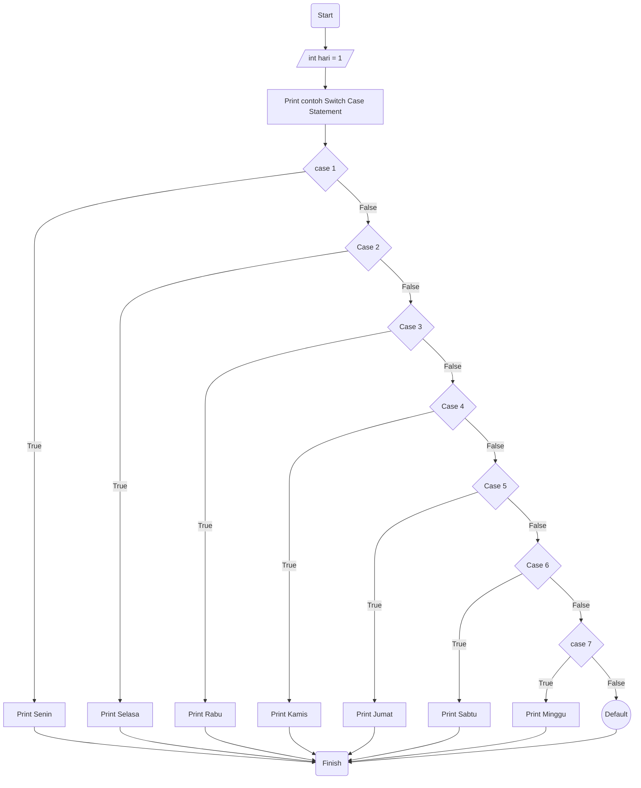

```mermaid
flowchart TD;

A(Start)-->B[/int hari = 1/];
B-->C[Print contoh Switch Case Statement];
C-->D{case 1};
D --True--> E[Print Senin];
D --False-->F{Case 2};
F--True--> G[Print Selasa];
F--False--> H{Case 3};
H--True--> I[Print Rabu];
H--False-->J{Case 4};
J--True-->K[Print Kamis];
J--False-->L{Case 5};
L--True-->M[Print Jumat];
L--False-->N{Case 6};
N--True-->O[Print Sabtu];
N--False-->P{case 7};
P--True-->Q[Print Minggu];
P--False-->R((Default));
E & G & I & K & M & O & Q & R -->S(Finish);

```
